# Klassendiagramm — DSA Heldenverwaltung

Visuelle Übersicht aller Kernklassen und ihrer Relationen.
Schichten: **Domain → State → Rules → Data → Catalog**

---

## Diagramm

```mermaid
classDiagram
    %% ===== DOMAIN =====

    class HeroSheet {
        +String id
        +String name
        +int level
        +Attributes attributes
        +Attributes rawStartAttributes
        +Attributes startAttributes
        +StatModifiers persistentMods
        +BoughtStats bought
        +CombatConfig combatConfig
        +Map~String,HeroTalentEntry~ talents
        +List~HeroMetaTalent~ metaTalents
        +Map~String,HeroSpellEntry~ spells
        +List~HeroInventoryEntry~ inventoryEntries
        +List~HeroRitualCategory~ ritualCategories
        +List~MagicSpecialAbility~ magicSpecialAbilities
        +int apTotal / apSpent
        +int schemaVersion
        +copyWith() HeroSheet
    }

    class HeroState {
        +int currentLep
        +int currentAsp
        +int currentKap
        +int currentAu
        +StatModifiers tempMods
        +AttributeModifiers tempAttributeMods
        +int schemaVersion
        +empty()$ HeroState
        +copyWith() HeroState
    }

    class Attributes {
        +int mu, kl, inn, ch
        +int ff, ge, ko, kk
    }

    class AttributeModifiers {
        +int mu, kl, inn, ch
        +int ff, ge, ko, kk
        +operator+()
    }

    class StatModifiers {
        +int lep, au, asp, kap, mr
        +int iniBase, at, pa, fk, gs
        +int ausweichen, rs
        +operator+()
    }

    class BoughtStats {
        +int lep, au, asp, kap, mr
    }

    class CombatConfig {
        +List~MainWeaponSlot~ weapons
        +int selectedWeaponIndex
        +OffhandAssignment offhandAssignment
        +List~OffhandEquipmentEntry~ offhandEquipment
        +ArmorConfig armor
        +CombatSpecialRules specialRules
        +CombatManualMods manualMods
        +List~WaffenmeisterConfig~ waffenmeisterschaften
    }

    class MainWeaponSlot {
        +String name
        +String talentId
        +WeaponCombatType combatType
        +int tpDiceCount, tpDiceSides, tpFlat
        +int wmAt, wmPa, iniMod
        +RangedWeaponProfile rangedProfile
    }

    class WaffenmeisterConfig {
        +String talentId
        +String weaponType
        +bool isSchild
        +List~WaffenmeisterBonus~ bonuses
        +String masterName
        +String requiredAttribute1, requiredAttribute2
        +int requiredAttribute1Value, requiredAttribute2Value
    }

    class WaffenmeisterBonus {
        +WaffenmeisterBonusType type
        +int value
        +String targetManeuver
    }

    class HeroTalentEntry {
        +int talentValue, atValue, paValue
        +List~HeroTalentModifier~ talentModifiers
        +bool gifted
        +String specializations
    }

    class HeroTalentModifier {
        +int modifier
        +String description
    }

    class HeroSpellEntry {
        +int spellValue
        +int modifier
        +bool hauszauber
        +bool gifted
        +String learnedRepresentation
        +String learnedTradition
        +HeroSpellTextOverrides textOverrides
    }

    class HeroMetaTalent {
        +String id
        +String name
        +List~String~ componentTalentIds
        +List~String~ attributes
        +String be
    }

    class HeroInventoryEntry {
        +String gegenstand
        +InventoryItemType itemType
        +bool istAusgeruestet
        +List~InventoryItemModifier~ modifiers
        +int gewichtGramm, wertSilber
    }

    class HeroTransferBundle {
        +DateTime exportedAt
        +HeroSheet hero
        +HeroState state
        +toJson()$ String
        +fromJson(Map)$ HeroTransferBundle
    }

    %% ===== STATE =====

    class HeroComputedSnapshot {
        +HeroSheet hero
        +HeroState state
        +ModifierParseResult modifierParse
        +Attributes effectiveStartAttributes
        +Attributes attributeMaximums
        +Attributes effectiveAttributes
        +DerivedStats derivedStats
        +CombatPreviewStats combatPreviewStats
        +StatModifiers inventoryStatMods
        +AttributeModifiers inventoryAttributeMods
        +Map~String,int~ inventoryTalentMods
    }

    class HeroIndexSnapshot {
        +List~String~ sortedIds
        +Map~String,HeroSheet~ byId
        +fromMap(Map)$ HeroIndexSnapshot
        +heroes() List~HeroSheet~
    }

    class HeroActions {
        +createHero(name, attrs) Future~String~
        +saveHero(HeroSheet) Future
        +saveHeroState(id, HeroState) Future
        +deleteHero(id) Future
        +buildExportJson(id) Future~String~
        +parseImportJson(raw) Future~HeroTransferBundle~
        +importHeroBundle(bundle, resolution) Future~String~
    }

    %% ===== RULES =====

    class DerivedStats {
        +int maxLep, maxAu, maxAsp, maxKap
        +int mr, iniBase
        +int atBase, paBase, fkBase
        +int gs, ausweichen
    }

    class CombatPreviewStats {
        +int rsTotal, beKampf
        +int at, pa
        +int iniBase, initiative
        +bool isRangedWeapon
        +int reloadTime
        +bool waffenmeisterActive
        +String waffenmeisterName
        +int waffenmeisterAtBonus, waffenmeisterPaBonus
    }

    class ModifierParseResult {
        +AttributeModifiers attributeMods
        +StatModifiers statMods
        +bool hasFlinkFromVorteile
        +bool hasBehaebigFromNachteile
        +List~String~ unknownFragments
    }

    %% ===== DATA =====

    class HeroRepository {
        <<abstract>>
        +watchHeroIndex() Stream~Map~
        +listHeroes() Future~List~
        +loadHeroById(id) Future~HeroSheet?~
        +saveHero(HeroSheet) Future
        +deleteHero(id) Future
        +watchHeroState(id) Stream~HeroState~
        +loadHeroState(id) Future~HeroState?~
        +saveHeroState(id, HeroState) Future
    }

    class HiveHeroRepository {
        -Box _heroesBox
        -Box _statesBox
        -Map _heroIndex
        +create(storagePath)$ Future~HiveHeroRepository~
        +close()
    }

    class HeroTransferCodec {
        +encode(HeroTransferBundle) String
        +decode(rawJson) HeroTransferBundle
    }

    %% ===== CATALOG =====

    class RulesCatalog {
        +String version
        +List~TalentDef~ talents
        +List~SpellDef~ spells
        +List~WeaponDef~ weapons
        +List~ManeuverDef~ maneuvers
        +List~CombatSpecialAbilityDef~ combatSpecialAbilities
        +List~SpracheDef~ sprachen
        +List~SchriftDef~ schriften
    }

    class TalentDef {
        +String id, name, group
        +String steigerung
        +List~String~ attributes
        +String be
        +bool active
    }

    class SpellDef {
        +String id, name, tradition
        +String steigerung
        +List~String~ attributes
        +bool active
    }

    class WeaponDef {
        +String id, name, combatSkill
        +String tp, tpkk
        +int atMod, paMod
        +List~String~ possibleManeuvers
        +bool active
    }

    class ManeuverDef {
        +String id, name, gruppe
        +String erschwernis
        +String voraussetzungen
    }

    class CombatSpecialAbilityDef {
        +String id, name
        +String stilTyp
        +List~String~ aktiviertManoeverIds
        +List~CombatSpecialAbilityBonusDef~ kampfwertBoni
        +isUnarmedCombatStyle bool
    }

    %% ===== RELATIONEN =====

    %% Domain – HeroSheet
    HeroSheet *-- Attributes : attributes / rawStart / start
    HeroSheet *-- StatModifiers : persistentMods
    HeroSheet *-- BoughtStats : bought
    HeroSheet *-- CombatConfig : combatConfig
    HeroSheet *-- "0..*" HeroTalentEntry : talents
    HeroSheet *-- "0..*" HeroMetaTalent : metaTalents
    HeroSheet *-- "0..*" HeroSpellEntry : spells
    HeroSheet *-- "0..*" HeroInventoryEntry : inventoryEntries

    %% Domain – HeroState
    HeroState *-- StatModifiers : tempMods
    HeroState *-- AttributeModifiers : tempAttributeMods

    %% Domain – CombatConfig
    CombatConfig *-- "0..*" MainWeaponSlot : weapons
    CombatConfig *-- "0..*" WaffenmeisterConfig : waffenmeisterschaften
    WaffenmeisterConfig *-- "0..*" WaffenmeisterBonus : bonuses

    %% Domain – Talente
    HeroTalentEntry *-- "0..*" HeroTalentModifier : talentModifiers

    %% Domain – Transfer
    HeroTransferBundle *-- HeroSheet : hero
    HeroTransferBundle *-- HeroState : state

    %% State
    HeroComputedSnapshot o-- HeroSheet : hero
    HeroComputedSnapshot o-- HeroState : state
    HeroComputedSnapshot *-- ModifierParseResult : modifierParse
    HeroComputedSnapshot *-- DerivedStats : derivedStats
    HeroComputedSnapshot *-- CombatPreviewStats : combatPreviewStats
    HeroComputedSnapshot *-- StatModifiers : inventoryStatMods
    HeroComputedSnapshot *-- AttributeModifiers : inventoryAttributeMods

    HeroIndexSnapshot o-- "0..*" HeroSheet : byId

    %% Rules
    ModifierParseResult *-- AttributeModifiers : attributeMods
    ModifierParseResult *-- StatModifiers : statMods
    DerivedStats ..> HeroSheet : berechnet aus
    DerivedStats ..> HeroState : berechnet aus
    CombatPreviewStats ..> HeroSheet : berechnet aus
    CombatPreviewStats ..> DerivedStats : nutzt
    CombatPreviewStats ..> RulesCatalog : Katalogdaten

    %% Data
    HiveHeroRepository --|> HeroRepository : implements
    HeroActions ..> HeroRepository : uses
    HeroActions ..> HeroTransferCodec : uses
    HeroTransferCodec ..> HeroTransferBundle : encode/decode

    %% Catalog
    RulesCatalog *-- "0..*" TalentDef : talents
    RulesCatalog *-- "0..*" SpellDef : spells
    RulesCatalog *-- "0..*" WeaponDef : weapons
    RulesCatalog *-- "0..*" ManeuverDef : maneuvers
    RulesCatalog *-- "0..*" CombatSpecialAbilityDef : combatSpecialAbilities
```

---

## Legende

| Symbol | Bedeutung |
|--------|-----------|
| `*--`  | Komposition — Owner besitzt das Objekt (Lebensdauer gebunden) |
| `o--`  | Aggregation — Referenz, kein Ownership |
| `--|>` | Implementierung / Vererbung |
| `..>`  | Abhängigkeit / Nutzung (Funktionsparameter, Provider-Read) |

---

## Schichtenbeschreibung

### Domain (`lib/domain/`)

`HeroSheet` ist die persistierte Wurzel des Datenmodells. Alle Heldenfelder
sind immutable und werden via `copyWith` geändert. `HeroState` hält den
flüchtigen Laufzeitzustand (aktuelle LeP/AsP/KaP/Au und temporäre Modifikatoren).

`CombatConfig` kapselt die gesamte Kampfkonfiguration mit Waffenslots,
Parierwaffen, Rüstung, Sonderregeln und Waffenmeisterschaften.

### State (`lib/state/`)

`HeroComputedSnapshot` ist der zentrale Aggregator — er fasst `HeroSheet`,
`HeroState`, geparste Modifikatoren und alle berechneten Werte in einem
unveränderlichen Objekt zusammen. Alle UI-Widgets lesen ausschließlich
daraus. `HeroIndexSnapshot` ermöglicht O(1)-Heldensuche per ID.
`HeroActions` ist die einzige Schreibschnittstelle für die UI.

### Rules (`lib/rules/derived/`)

Pure Dart-Funktionen ohne Seiteneffekte. Sie berechnen `DerivedStats`
(LeP, AsP, KaP, Au, MR, INI, AT/PA-Basis) und `CombatPreviewStats`
(aktive Kampfwerte inkl. Waffenmeisterschaften und Katalogdaten).
`ModifierParseResult` hält das Ergebnis des Freitext-Modifikatorparsers.

### Data (`lib/data/`)

`HeroRepository` definiert das abstrakte Interface; `HiveHeroRepository`
implementiert es mit Hive-Boxen und einem reaktiven In-Memory-Index.
`HeroTransferCodec` kodiert/dekodiert `HeroTransferBundle` für Export/Import.

### Catalog (`lib/catalog/`)

`RulesCatalog` hält alle Spieldefinitionen (Talente, Zauber, Waffen,
Manöver, Kampf-Sonderfertigkeiten, Sprachen, Schriften). Er wird beim
App-Start aus den Split-JSON-Assets geladen und ist danach read-only.
